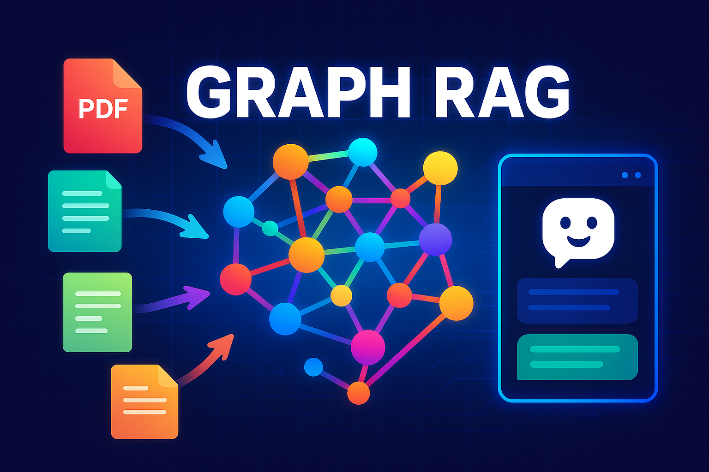
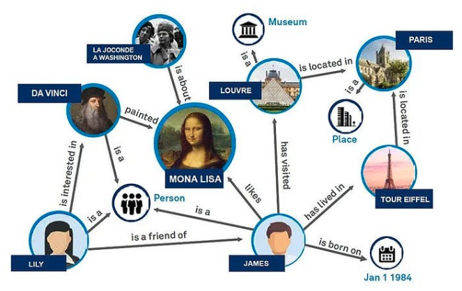
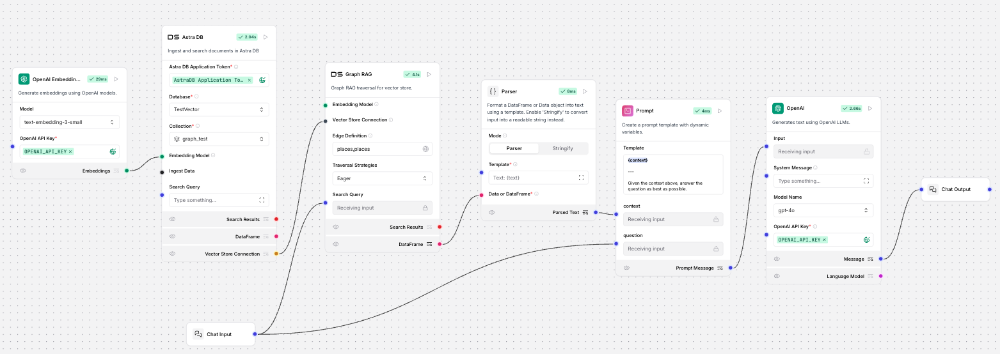
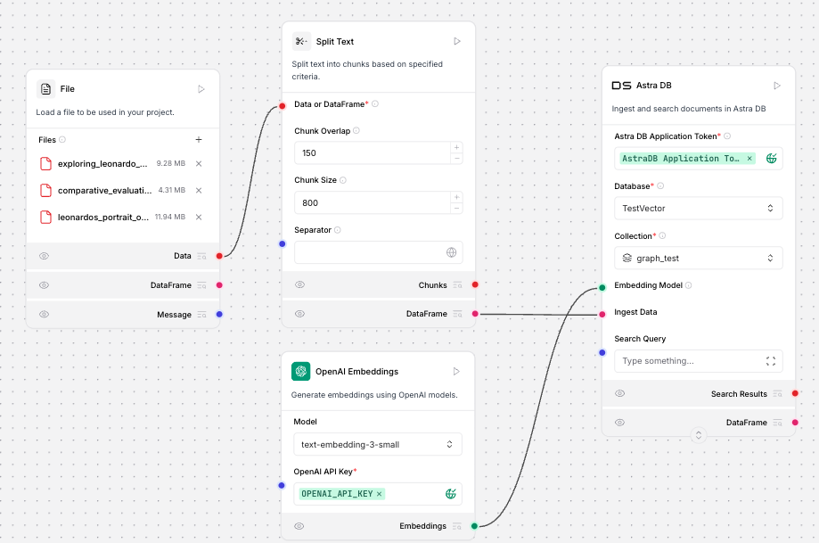
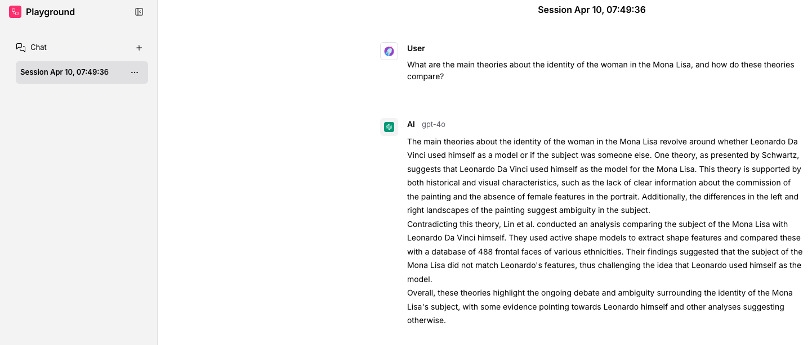
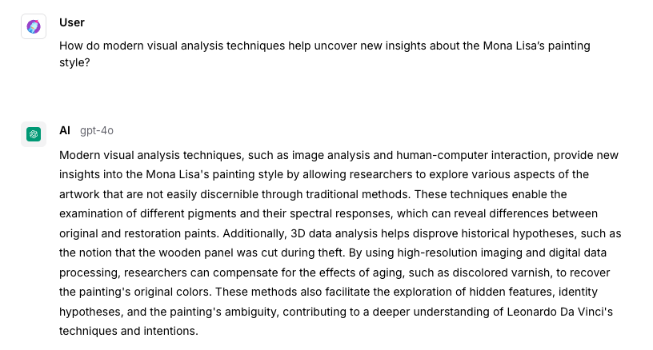
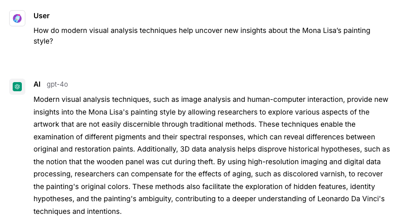

  

---

- [Graph RAG with LangFlow and AstraDB](#graph-rag-with-langflow-and-astradb)
   * [🤔 What is Graph RAG?](#-what-is-graph-rag)
   * [📌 Why use Graph RAG instead of Classical RAG?](#-why-use-graph-rag-instead-of-classical-rag)
   * [🎨 LangFlow Graph RAG Example](#-langflow-graph-rag-example)
      + [What’s happening in this workflow?](#whats-happening-in-this-workflow)
   * [📥 Ingesting Historical Documents into AstraDB](#-ingesting-historical-documents-into-astradb)
      + [1. Preparing Your Documents](#1-preparing-your-documents)
      + [2. Setting Up Your LangFlow Workflow](#2-setting-up-your-langflow-workflow)
         - [Why These Settings?](#why-these-settings)
      + [3. Running Your Ingestion Workflow](#3-running-your-ingestion-workflow)
   * [🧭 Choosing the Right Traversal Strategy in Graph RAG](#-choosing-the-right-traversal-strategy-in-graph-rag)
      + [Why `Eager` Works Best for This Use Case](#why-eager-works-best-for-this-use-case)
         - [What `Eager` Does?](#what-eager-does)
      + [Other Strategies and Why We Didn't Use Them (for now)](#other-strategies-and-why-we-didnt-use-them-for-now)
      + [Summary:](#summary)
   * [🧪 Testing the Graph RAG Setup](#-testing-the-graph-rag-setup)
      + [🧪 Test Question 1: Identity of the Mona Lisa](#-test-question-1-identity-of-the-mona-lisa)
      + [✅ Result Using Graph RAG:](#-result-using-graph-rag)
      + [🧪 Test Question 2: Modern Visual Analysis Techniques](#-test-question-2-modern-visual-analysis-techniques)
      + [✅ Result Using Graph RAG:](#-result-using-graph-rag-1)
      + [🧪 Test Question 3: Comparing Mona Lisa Versions](#-test-question-3-comparing-mona-lisa-versions)
      + [✅ Result Using Graph RAG:](#-result-using-graph-rag-2)
   * [✅ Results Summary](#-results-summary)
      + [🎯 Key Takeaways](#-key-takeaways)
    * [⚠️ When Not to Use Graph RAG](#when-not-to-use-graph-rag)
      + [1. 🧾 Simple, Fact-Based Queries](#1simple-fact-based-queries)
      + [2. 🚫 No Meaningful Connections Between Documents](#2----no-meaningful-connections-between-documents)
      + [3. 🛠 More Complex Setup, Especially for Beginners](#3----more-complex-setup--especially-for-beginners)
      + [4. 🐌 Performance Considerations](#4----performance-considerations)

---

# Graph RAG with LangFlow and AstraDB

This guide will show you how to build smarter AI chatbots or assistants using Graph Retrieval-Augmented Generation (Graph RAG).
We will use two tools for this:

- **LangFlow** (version 1.3), a visual tool for creating AI workflows.
- **AstraDB**, a cloud-based database for storing and searching data.

You'll learn step-by-step what Graph RAG is, why it’s useful, and how to create your own example.

---

## 🤔 What is Graph RAG?

Graph RAG is a smarter way for AI chatbots to find answers. Normally, chatbots read a large amount of text, break it into small pieces, and then search through these pieces when you ask a question. This works okay, but it has limits, especially if the answer involves combining multiple facts or ideas.

Graph RAG solves this by organizing information in a graph. In this graph:

- **Nodes** represent concepts or pieces of information (like people, places, products, or ideas).
- **Edges** show how these nodes are connected or related.

This structure helps the chatbot understand how different bits of information fit together, allowing it to answer more complex questions accurately.

Here is a nice image I got from the [LangChain blog](https://blog.langchain.dev/enhancing-rag-based-applications-accuracy-by-constructing-and-leveraging-knowledge-graphs/).

  

## 📌 Why use Graph RAG instead of Classical RAG?

| Classical RAG                          | Graph RAG                                    |
|----------------------------------------|----------------------------------------------|
| Breaks text into chunks                | Organizes information into connected graphs  |
| Finds answers based only on similarity | Finds answers based on real relationships    |
| Struggles with complex questions       | Easily handles complex, multi-step questions |
| Harder to see why it picks answers     | Easy to understand why answers were chosen   |

Simply put, Graph RAG is better for questions that require connecting multiple facts, making your AI smarter and more accurate.

---

## 🎨 LangFlow Graph RAG Example

Here's a simple example of how you can set up Graph RAG using LangFlow (v1.3):

If you'd like to bring this flow into your own Langflow account, just use the JSON file linked [here](apps/Graph_RAG.json).

### What’s happening in this workflow?

1. **Embedding with OpenAI**  
   We first convert our documents into special number representations (vectors) using OpenAI embeddings. These vectors help the chatbot quickly find related information.

2. **Storing Vectors in AstraDB**  
   These vectors are stored in AstraDB, making it easy and fast to search for similar documents when someone asks a question.

3. **Graph RAG Node**  
   This node searches AstraDB, not just for similar pieces of text, but also for connections between them. It finds related pieces of information by following these connections.

4. **Parser and Prompt**  
   The results from the Graph RAG node are formatted nicely to create a clear context. This context helps our chatbot (the language model) better understand what the question is about.

5. **OpenAI Chat (GPT-4o)**  
   Finally, we use GPT-4o from OpenAI to produce a helpful and accurate answer based on this context.

In your LangFlow workflow, the Graph RAG node offers four different traversal strategies, each affecting how the graph is searched for information when answering a question:

| Strategy       | Simple Explanation                             | When to Use?                                  |
|----------------|-------------------------------------------------|-----------------------------------------------|
| **Eager**      | Quickly explores many nodes, gathering lots of information. | When you want detailed answers with broad context. |
| **MMR**        | Finds information that's both relevant and different, avoiding repetitive results. | To provide balanced and varied answers.       |
| **NodeTracker**| Avoids checking the same node twice, preventing loops and repetitive info. | Useful for complex, highly connected graphs.  |
| **Scored**     | Picks only the most relevant nodes, giving precise answers. | Ideal for short and accurate responses.       |

## 📥 Ingesting Historical Documents into AstraDB

In this step, we'll ingest our historical documents about Leonardo da Vinci’s *Mona Lisa* into the AstraDB vector database using LangFlow. Here's how we set it up clearly and effectively:

### 1. Preparing Your Documents
We've selected these three historical PDFs about the *Mona Lisa*:
- **Leonardo’s Portrait of Mona Lisa** by Frank Zöllner
- **Comparative Evaluation of Mona Lisa Copies** by Giovanni Maria Pala
- **Exploring Mona Lisa with Visual Computing** by Alessia Amelio

### 2. Setting Up Your LangFlow Workflow
Below is the LangFlow workflow setup used to ingest the PDFs:

If you'd like to bring this flow into your own Langflow account, just use the JSON file linked [here](apps/ingest_multiple_files.json).

Here are the key nodes and their functions clearly explained:

- **File Component**: Load your PDFs here. You can upload multiple documents easily.
- **Split Text Component**: Splits documents into smaller pieces called "chunks," making retrieval easier and more precise.
  - Recommended settings:
    - **Chunk Size**: `800` (characters)
    - **Chunk Overlap**: `150` (characters)
- **OpenAI Embeddings Component**: Converts text chunks into embeddings (vector representations).
  - Recommended embedding model: `text-embedding-3-small`
- **AstraDB Component**: Stores the embeddings, enabling fast and accurate searching.
  - Database and collection: Use clear names for easy reference, e.g., Database: `HistoricalDocs`, Collection: `MonaLisa`.

#### Why These Settings?
- **Chunk Size (800)**: The default value is `1000`, but smaller chunks provide precise information retrieval, ensuring each chunk covers a focused topic.
- **Chunk Overlap (150)**: The default value is `200`, but smaller overlap reduces redundancy, saving vector storage without losing contextual continuity.
- **Embedding Model (text-embedding-3-small)**: Provides fast, accurate embeddings suitable for effective semantic searches.

### 3. Running Your Ingestion Workflow
After configuring these parameters, run the workflow to store your historical document embeddings in AstraDB.

Your documents are now ready for querying. The next step will demonstrate how Graph RAG uses this data to answer complex questions with accuracy and depth.

---

## 🧭 Choosing the Right Traversal Strategy in Graph RAG

Graph RAG lets you choose different strategies to search through your knowledge graph. Each strategy controls how information is gathered from connected nodes.

For this project, we selected the **`Eager` traversal strategy**, and here’s why:

### Why `Eager` Works Best for This Use Case

Our dataset includes **three different but related documents** about the *Mona Lisa*, covering:
- Leonardo da Vinci’s artistic techniques,
- Comparisons of Mona Lisa copies, and
- Modern visual analysis of the painting.

These documents refer to **shared concepts** (e.g. “Leonardo da Vinci,” “Louvre,” “smile,” “eyes,” “painting style”), but each document approaches the topic from a different angle. To generate the best answers, we need to **gather and combine** relevant information from all documents—not just one.

#### What `Eager` Does?
- It **aggressively follows connections** in the graph to collect all related chunks.
- This means it can combine different perspectives from multiple documents into one coherent answer.
- It’s ideal for **exploratory or multi-hop queries** like:
  - *“What are the artistic interpretations of Mona Lisa’s smile?”*
  - *“How do modern techniques compare the Mona Lisa with her copies?”*

### Other Strategies and Why We Didn't Use Them (for now):
| Strategy     | Why we didn't use it here                                           |
|--------------|---------------------------------------------------------------------|
| **MMR**      | Aims to reduce redundancy but may skip some useful related info.   |
| **NodeTracker** | Helps in loop-heavy graphs but wasn’t necessary for this test set. |
| **Scored**   | Prioritizes precision but might miss broader contextual links.     |

### Summary:
We chose `Eager` because it helps us pull in **as much connected information as possible** from all three documents—ideal for showcasing how Graph RAG outperforms classical RAG when documents are related but individually incomplete.

---

## 🧪 Testing the Graph RAG Setup

Now that we’ve ingested our historical documents about the Mona Lisa and set up the Graph RAG workflow, it's time to test how well it performs when answering complex questions.

The goal is to ask questions that go **beyond basic keyword matching** and require combining knowledge from different parts of the graph - that’s where Graph RAG works great.

Here are the questions we used and why they were chosen:

---

### 🧪 Test Question 1: Identity of the Mona Lisa

**Question asked:** What are the main theories about the identity of the woman in the Mona Lisa, and how do these theories compare?

### ✅ Result Using Graph RAG:
The answer provided a **well-balanced summary** of different theories:

- It explained a theory from Schwartz suggesting that **Leonardo da Vinci used himself** as the model, backed by historical and visual cues.
- It then introduced a **contradictory view** from Lin et al., who used modern shape analysis to compare the painting to da Vinci’s facial features, finding no match.
- Finally, it **summarized the debate**, showing that there’s still ambiguity and ongoing scholarly discussion.

> 🧠 **Why this matters:**  
> This is a great example of how Graph RAG goes beyond simple retrieval. It connects **multiple perspectives from different documents** and builds a complete, nuanced answer.  
> A classical RAG setup might only provide one viewpoint—or even miss key analysis entirely.

📌 **Takeaway:**  
This test clearly demonstrates that Graph RAG can **synthesize complex, multi-source information** to deliver answers that are richer, more accurate, and more insightful.

---

### 🧪 Test Question 2: Modern Visual Analysis Techniques

**Question asked:** How do modern visual analysis techniques help uncover new insights about the Mona Lisa’s painting style?”

### ✅ Result Using Graph RAG:
The answer included a range of **modern techniques** used to analyze the painting:

- **Image analysis and spectral pigment comparison** help identify differences between original and restored paint layers.
- **3D data analysis** has helped researchers disprove certain myths (like damage from theft).
- **High-resolution imaging** allows scientists to digitally “undo” the effects of aging, such as discolored varnish.
- The response even covered how these techniques allow for the **exploration of hidden features**, identity clues, and stylistic intentions.

> 🧠 **Why this is impressive:**  
> Traditional RAG would likely return only one chunk describing *a single method* (e.g., spectral analysis).  
> But Graph RAG **gathered multiple interconnected points** from across the documents and wove them into a **cohesive summary**.

📌 **Takeaway:**  
This result shows that Graph RAG can answer **deep, technical questions** by combining factual, procedural, and interpretive data. It doesn’t just list tools — it explains **why** and **how** they matter.

---

### 🧪 Test Question 3: Comparing Mona Lisa Versions

**Question asked:** In what ways do the known copies of the Mona Lisa differ from the original, and what do experts think these differences reveal?

### ✅ Result Using Graph RAG:
The response drew from several angles:

- It explained how modern analysis tools are used to compare **facial features and proportions** across the original and known copies.
- It mentioned **shape modeling techniques** and the use of large databases of facial features to evaluate whether a copy may have originated from the same model or artist.
- The result also highlighted how **differences in detail and expression** between copies are used to propose new theories or challenge existing ones.

> 🧠 **Why this stands out:**  
> This is a perfect example of **multi-document synthesis**. The answer blends historical insights with digital methods and expert interpretation — something classical RAG setups struggle to do cohesively.

📌 **Takeaway:**  
Graph RAG made it possible to **connect evaluations of visual differences** with deeper historical meaning, creating an answer that is both technically detailed and easy to understand.

---

## ✅ Results Summary

After testing three real-world questions based on our ingested documents about the Mona Lisa, here’s how **Graph RAG** performed:

| Question # | Topic                                                                 | Graph RAG Result                                                                 |
|------------|-----------------------------------------------------------------------|----------------------------------------------------------------------------------|
| **1**      | Theories about the Mona Lisa’s identity                               | Provided multiple viewpoints, compared them clearly, and acknowledged uncertainty. |
| **2**      | How modern techniques reveal new painting insights                    | Explained several distinct analysis methods and how each helps understand the art. |
| **3**      | Differences between Mona Lisa copies and expert interpretations       | Combined visual comparisons with expert opinion to show both technique and meaning. |

### 🎯 Key Takeaways
- **Graph RAG successfully connected related information** across multiple documents.
- It **generated coherent, comparative, and complete answers**, even when no single source held the full picture.
- Answers were **more detailed and balanced** than what we’d typically get from classical RAG (which only retrieves isolated text chunks).

---

> ✅ **Conclusion:**  
> These results show that Graph RAG isn’t just about retrieval — it’s about **reasoning across connected knowledge**. This makes it perfect for research-heavy topics, technical documentation, and any domain where the full answer lives across multiple sources.

---

## ⚠️ When Not to Use Graph RAG

While Graph RAG is powerful, it's not always the best fit for every use case. Like any tool, it shines in some scenarios and adds unnecessary complexity in others.

Here are some situations where **Graph RAG might not be the right choice**:

---

### 1. 🧾 Simple, Fact-Based Queries

If your use case involves:
- Short documents,
- Direct fact lookup (e.g., “When was the Mona Lisa painted?”),
- Or a small number of text chunks,

Then classical RAG is **faster, simpler, and easier to maintain**. You don’t need multi-hop reasoning to answer straightforward questions.

---

### 2. 🚫 No Meaningful Connections Between Documents

Graph RAG works best when:
- There are **recurring entities or topics** (like “Leonardo,” “Louvre,” “visual analysis”),
- And those topics benefit from being **connected**.

But if your dataset is **broad and unrelated** (e.g., documents about cooking, airplanes, and guitar tuning), creating a graph may:
- Add unnecessary overhead,
- Return irrelevant connections,
- And give worse results than a simple semantic search.

---

### 3. 🛠 More Complex Setup, Especially for Beginners

Graph RAG requires:
- A deeper understanding of vector stores,
- Traversal strategies,
- Edge definitions,
- And sometimes custom configurations.

If you're just starting with LangChain, LangFlow, or vector search, it might be better to begin with a **classical RAG** setup and upgrade later.

---

### 4. 🐌 Performance Considerations

Graph RAG performs **extra steps** like:
- Graph traversal,
- Building and managing node-edge relationships.

This can be **slower and more resource-intensive**, especially on large datasets, compared to traditional top-K similarity search.

---

> 💡 **Summary:**  
> Use Graph RAG when your data is **richly interconnected**, and the value of combining insights from multiple places outweighs the extra setup.  
> For simpler tasks, classical RAG will often be **faster, easier, and good enough**.

